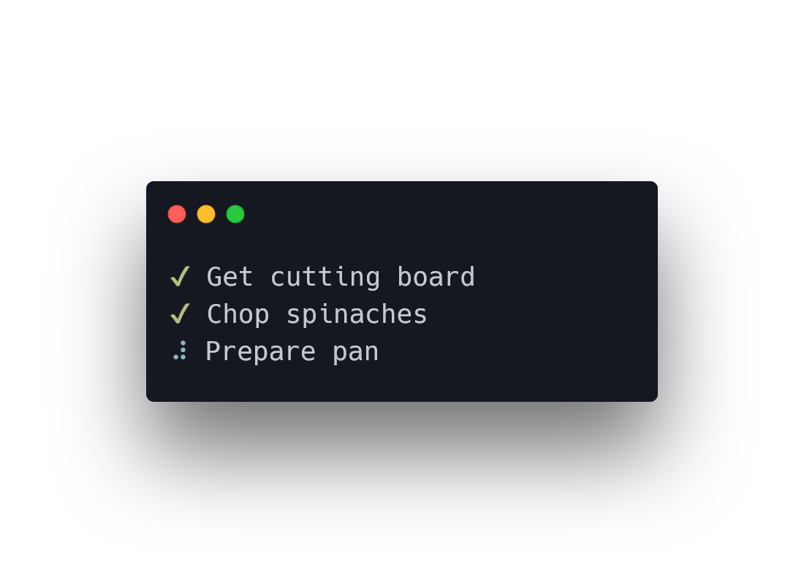

# 🥬 spinach

> Practical spinner for Rust 

<p align="center">
	
</p>

## Install

Add as a dependency to your `Cargo.toml`.

```toml
[dependencies]
spinach = "1.0"
```

## Usage

Basic example.

```rust
use std::{thread::sleep, time::Duration};

use spinach;

fn main() {
    let s = spinach::Spinach::new("Running task 1");
    sleep(Duration::from_secs(1));
    s.text("Running task 2");
    sleep(Duration::from_secs(1));
    s.text("Tasks ran with success");
    s.succeed();
}
```
